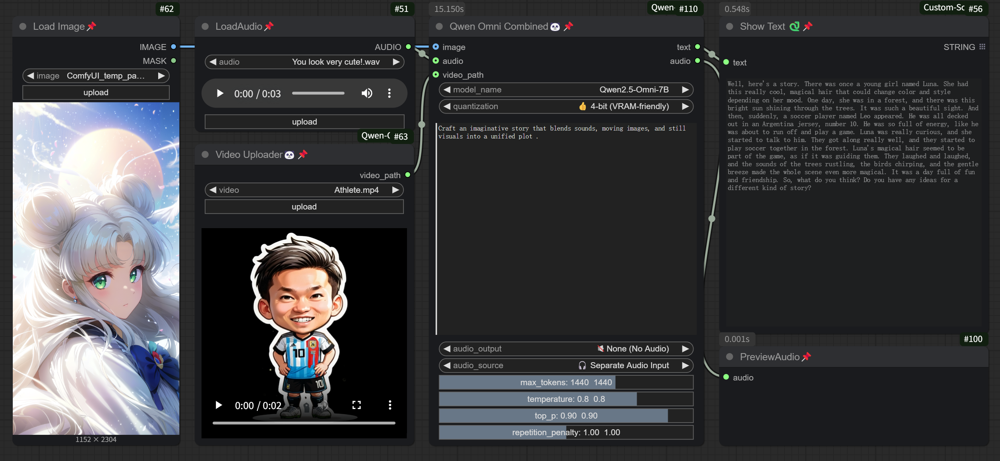

<div align="center">

# ComfyUI-Qwen-Omni 🐼

**当 Figma 遇上 VSCode，艺术思维碰撞工程逻辑 —— 这是设计师向代码世界发出的浪漫宣言。**  
✨ 基于 Qwen2.5-Omni-7B 的多模态革命性插件 ✨
  

[](https://github.com/SXQBW/ComfyUI-Qwen-Omni/stargazers)
[](https://huggingface.co/Qwen/Qwen2.5-Omni-7B)
</div>
<div align="center">
  
</div>


---


**基于 Qwen2.5-Omni-7B 的多模态大型语言模型 ComfyUI 插件**


🔄 ComfyUI-Qwen-Omni 是首个支持端到端多模态交互的 ComfyUI 插件，实现了文本、图像、音频的无缝联合生成与编辑。无需中间步骤，只需一次操作，即可让模型同时理解并处理多种输入模态，生成连贯的文本描述和语音输出，为 AI 创作提供前所未有的流畅体验。


这个插件将 Qwen2.5-Omni-7B 多模态大模型集成到 ComfyUI 中，支持文本、图像、音频和视频输入，并能生成文本和语音输出，为您的 AI 创作提供更丰富的交互体验。


## 🌟 特性亮点

- **多模态输入**：支持文本、图像、音频和视频作为输入
- **文本生成**：基于多模态输入生成连贯的文本描述
- **语音合成**：支持生成自然流畅的语音输出（男声/女声可选）
- **参数化控制**：可调整温度、最大 tokens、采样策略等生成参数
- **GPU 优化**：支持 4-bit/8-bit 量化，降低显存需求


## 🚀 安装方法

1. **克隆仓库到 ComfyUI 扩展目录**：

   ```bash
   cd ComfyUI/custom_nodes/
   git clone https://github.com/SXQBW/ComfyUI-Qwen-Omni.git
   cd ComfyUI-Qwen-Omni
   pip install -r requirements.txt
   ```

2. **下载模型文件**：

   插件会在首次运行时自动下载 Qwen2.5-Omni-7B 模型，或您也可以提前手动下载并放置到 `ComfyUI/models/Qwen/Qwen2.5-Omni-7B/` 目录下。

   📦 模型下载地址：

    <p align="left">
    🤗 <a href="https://huggingface.co/Qwen/Qwen2.5-Omni-7B">Hugging Face</a>&nbsp&nbsp | &nbsp&nbsp🤖 <a href="https://modelscope.cn/models/Qwen/Qwen2.5-Omni-7B">ModelScope</a>&nbsp&nbsp | &nbsp&nbsp</a>
    </p>

    > 另外我在夸克网盘和百度网盘也上传了模型文件（希望能帮到你 💖）

    <p align="left">
        ⬇ <a href="https://pan.quark.cn/s/fdc4f7a1a5f2">Quark Netdisk</a>&nbsp&nbsp · &nbsp&nbsp<a href="https://pan.baidu.com/s/1Ejpi5fvI6_m1t1WSqWom8A?pwd=xvzf">Baidu Netdisk</a>&nbsp&nbsp</a>
    </p>


## 📖 使用指南

1. 在 ComfyUI 中添加 "Qwen Omni Combined" 节点
2. 配置参数：
   - 选择量化方式（4-bit/8-bit/不量化）
   - 输入文本提示
   - 选择是否生成语音及语音类型
   - 调整生成参数（温度、最大 tokens 等）
3. 可选：连接图像、音频或视频输入
4. 执行节点生成结果


## 🎛️ 参数说明

| 参数               | 描述                                                                 |
|--------------------|----------------------------------------------------------------------|
| `max_tokens`       | 控制生成文本的最大长度（以 token 为单位）。通常，100 个 token 大约对应 50 - 100 个汉字或 67 - 100 个英文单词。 |
| `temperature`      | 控制生成多样性：较低值生成更结构化的内容，较高值生成更随机的内容。           |
| `top_p`            | 核采样阈值，控制词汇选择范围：接近 1 保留更多候选词，较小值生成更保守内容。 |
| `repetition_penalty` | 控制重复内容：>1 抑制重复，<1 鼓励重复强调。                              |
| `quantization`     | 模型量化选项：4-bit（显存友好）、8-bit（平衡精度）或不量化（高精度）。    |
| `audio_output`     | 语音输出选项：不生成语音、女声（Chelsie）或男声（Ethan）。               |


💡 我已经在节点界面加上了tips，鼠标悬浮到相应位置即可看到说明。


## 👀 功能示例
*在 ComfyUI 中的使用界面示例*

### 视频内容分析

示例：What's the content in the video?


<div style="overflow:hidden; padding:56.25% 0 0 0; position:relative;">
  <iframe src="https://www.youtube.com/watch?v=m6ECETmsKYc" style="position:absolute; top:0; left:0; width:100%; height:100%; border:0;" allowfullscreen></iframe>
</div>


*支持生成自然流畅的语音输出，点击观看*--[演示视频](https://www.youtube.com/watch?v=m6ECETmsKYc)


### 多模态输入

示例：Craft an imaginative story that blends sounds, moving images, and still visuals into a unified plot .


### 图像描述生成

示例：Just tell me the answers to the questions in the picture directly.


## 🙏 致谢

<br>衷心感谢以下团队和项目对 ComfyUI-Qwen-Omni 开发的支持与贡献  **请给他们的项目点⭐️**：</br>


- **Qwen 团队（阿里巴巴集团）**  
  感谢 Qwen-Omni 系列模型的开发者，特别是 **Qwen2.5-Omni-7B** 模型的开源贡献。  
  他们在多模态大模型领域的突破性工作，为插件提供了强大的底层能力支持。 
  - [Qwen2.5-Omni 官方项目](https://github.com/QwenLM/Qwen2.5-Omni) 
  - [Qwen 官方项目](https://github.com/QwenLM)

- **豆包团队（字节跳动）与   混元团队（腾讯）**  
  在插件开发过程中，豆包 AI 在代码调试、文档生成和问题排查中提供了重要帮助，极大提升了开发效率。  
  - [豆包官网](https://doubao.com) 
  - [混元官网](https://hunyuan.tencent.com/)


- **ComfyUI 社区**  
  ComfyUI 灵活的节点化架构为插件开发提供了理想的生态环境。  
  - [ComfyUI 项目](https://github.com/comfyanonymous/ComfyUI)


## 🌌 从设计到代码的奇幻漂流

2周前，我的武器库还只有Adobe全家桶和Figma源文件。  
作为全链路设计师（花了10年从UI->UX->PM升级为全能战士），我曾以为这辈子最大的挑战是说服甲方爸爸放弃「五彩斑斓的黑」。直到那个宿命般的深夜——当我第127次对着糟糕的API文档设计稿抓狂时，一个疯狂的念头破土而出：

**「为什么不让设计师自己来写代码？」**

于是，这个充满温度的项目诞生于：
- 🎨 艺术生的审美强迫症
- 💻 纯手工打造的Python初号机（是的，连pip都现学现卖）
- ⚡️ 对体验细节的极致苛求（虽然目前只能实现30%的设计构想）


### 🚧 当前能力边界
- 能流畅输出设计系统，但还在和异步IO较劲
- 精通交互原型，但面对递归函数依然瑟瑟发抖
- 可手绘精美架构图，但实际代码量还没超过500行

### 🌟 你的星星有多重要？
每个⭐️都是：
- 照亮设计者转型之路的灯塔
- 鞭策我攻克下个技术难关的代码之鞭
- 对「破圈者」最优雅的致敬（这可比Dribbble点赞酷多了！）

> "每个commit都是我与旧世界的决裂书" —— 那个在VSCode里笨拙敲击的设计师

**此刻，你指尖的星星✨**  
不仅是认可，更是设计思维与代码世界碰撞的宇宙大爆炸。当艺术生的美学执念遇上程序员的极客精神——这可能是GitHub上最浪漫的化学反应。

[点击Star见证跨界革命](https://github.com/SXQBW/ComfyUI-Qwen-Omni)


## 🤝 贡献

欢迎贡献代码、报告问题或提出建议！请提交 Pull Request 或创建 Issue。

欢迎以下形式的贡献：

✨ 新功能提案
🐛 问题报告（请包含复现步骤和日志）
📝 功能改进
🖼️ 示例工作流

如有其它问题或建议，联系我：[503887319@qq.com](mailto:503887319@qq.com)


