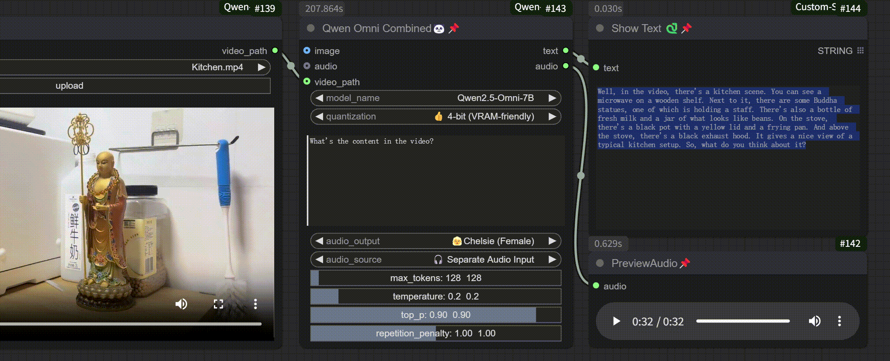
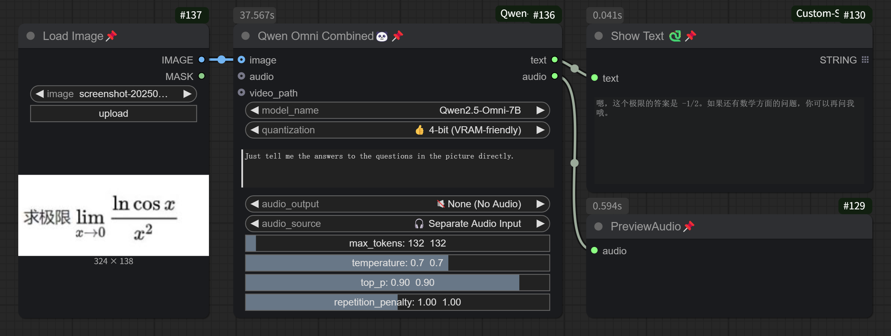

<div align="center">

# ComfyUI-Qwen-Omni 🐼
<p align="center">
        <a href="README_CN.md">中文</a> &nbsp｜ &nbsp English&nbsp&nbsp
</p>

**When Figma meets VSCode, the collision of artistic thinking and engineering logic — this is a romantic declaration from designers to the world of code.**  
✨ A revolutionary multimodal plugin based on Qwen2.5-Omni ✨
  
[](https://github.com/SXQBW/ComfyUI-Qwen-Omni/stargazers)
[](https://huggingface.co/Qwen/Qwen2.5-Omni-7B)
</div>
<div align="center">
  
</div>

---

**A ComfyUI plugin based on the multimodal large language model Qwen2.5-Omni**

🔄 ComfyUI-Qwen-Omni is the first ComfyUI plugin that supports end-to-end multimodal interaction, enabling seamless joint generation and editing of text, images, and audio. Without intermediate steps, with just one operation, the model can simultaneously understand and process multiple input modalities, generating coherent text descriptions and voice outputs, providing an unprecedentedly smooth experience for AI creation.

This plugin integrates the Qwen2.5-Omni multimodal large model into ComfyUI, supporting text, image, audio, and video inputs, and capable of generating text and voice outputs, offering a more diverse interactive experience for your AI creation.

## 🌟 Features

- **Dual-Mode Omni**: Supports Qwen2.5-Omni-3B and Qwen2.5-Omni-7B models.
- **Multimodal input**: Supports text, images, audio, and video as inputs.
- **Text generation**: Generates coherent text descriptions based on multimodal inputs.
- **Speech synthesis**: Supports generating natural and fluent voice outputs (male or female voices available).
- **Parameterized control**: Allows adjustment of generation parameters such as temperature, maximum tokens, and sampling strategy.
- **GPU optimization**: Supports 4-bit/8-bit quantization to reduce video memory requirements.

## 🚀 Installation

1.**Clone the repository to the ComfyUI extension directory**:

   ```bash
   cd ComfyUI/custom_nodes/
   git clone https://github.com/SXQBW/ComfyUI-Qwen-Omni.git
   cd ComfyUI-Qwen-Omni
   pip install -r requirements.txt
```
2.**Download Model files**:

When first launched, the model will be automatically downloaded (based on your selection of Qwen2.5-Omni-3B or Qwen2.5-Omni-7B and network conditions, it will prioritize downloads from Hugging Face or ModelScope). Alternatively, you may manually download and place it in the ComfyUI/models/Qwen/ directory.

📦 Model download links:
<p align="left">
🤗 <a href="https://huggingface.co/Qwen/Qwen2.5-Omni-7B">Hugging Face</a>&nbsp&nbsp | &nbsp&nbsp🤖 <a href="https://modelscope.cn/models/Qwen/Qwen2.5-Omni-7B">ModelScope</a>&nbsp&nbsp | &nbsp&nbsp</a>
</p>

>Additionally, I've uploaded the model files to Quark Netdisk and Baidu Netdisk (hope it helps you 💖).

<p align="left">
⬇ <a href="https://pan.quark.cn/s/fdc4f7a1a5f2">Quark Netdisk</a>&nbsp&nbsp · &nbsp&nbsp<a href="https://pan.baidu.com/s/1Ejpi5fvI6_m1t1WSqWom8A?pwd=xvzf">Baidu Netdisk</a>&nbsp&nbsp</a>
</p>


## 📖 Usage Guide


1. Add the "Qwen Omni Combined" node in ComfyUI.
2. Configure the parameters:
   - Select the quantization method (4-bit/8-bit/no quantization).
   - Enter the text prompt.
   - Choose whether to generate voice and the voice type.
   - Adjust the generation parameters (temperature, maximum tokens, etc.).
3. Optional: Connect image, audio, or video inputs.
4. Execute the node to generate the results.

## 🎛️ Parameter Explanation

| Parameter               | Description                                                                 |
|--------------------|----------------------------------------------------------------------|
| `max_tokens`       | Controls the maximum length of the generated text (in tokens). Generally, 100 tokens correspond to approximately 50 - 100 Chinese characters or 67 - 100 English words. |
| `temperature`      | Controls the generation diversity: lower values generate more structured content, while higher values generate more random content.           |
| `top_p`            | Nucleus sampling threshold, controlling the vocabulary selection range: closer to 1 retains more candidate words, while smaller values generate more conservative content. |
| `repetition_penalty` | Controls repetitive content: >1 suppresses repetition, <1 encourages repetitive emphasis.                              |
| `quantization`     | Model quantization options: 4-bit (video memory friendly), 8-bit (balanced accuracy), or no quantization (high accuracy).    |
| `audio_output`     | Voice output options: no voice generation, female voice (Chelsie), or male voice (Ethan).               |


💡 I've added tooltips to the node interface. Hover your mouse over the corresponding position to see the explanation.




## 👀 Function Examples
*Usage interface examples in ComfyUI*

### Video Content Analysis

Example: What's the content in the video?


<div style="overflow:hidden; padding:56.25% 0 0 0; position:relative;">
  <iframe src="https://www.youtube.com/watch?v=m6ECETmsKYc" style="position:absolute; top:0; left:0; width:100%; height:100%; border:0;" allowfullscreen></iframe>
</div>


*Supports generating natural and fluent voice outputs. Click to watch*--[Demo Video](https://www.youtube.com/watch?v=m6ECETmsKYc)


### Omni Input

Example: Craft an imaginative story that blends sounds, moving images, and still visuals into a unified plot .


### Image Description Generation

Example: Just tell me the answers to the questions in the picture directly.




## 🙏 Acknowledgments

<br>Heartfelt thanks to the following teams and projects for their support and contributions to the development of ComfyUI-Qwen-Omni.   
**Please give their projects a⭐️**：</br>


- **Qwen Team (Alibaba Group)**  
  Thanks to the developers of the Qwen-Omni series models, especially for the open-source contribution of the **Qwen2.5-Omni-7B** model.  
  Their groundbreaking work in the field of multimodal large models provides strong underlying support for the plugin.
  - [Qwen2.5-Omni Official Project](https://github.com/QwenLM/Qwen2.5-Omni) 
  - [Qwen Official Project](https://github.com/QwenLM)

- **Doubao Team (ByteDance) and Hunyuan Team (Tencent)**  
  During the plugin development process, Doubao AI provided important assistance in code debugging, documentation generation, and problem troubleshooting, greatly improving development efficiency.  
  - [Doubao Official Website](https://doubao.com) 
  - [Hunyuan Official Website](https://hunyuan.tencent.com/)


- **ComfyUI Community**  
  The flexible node-based architecture of ComfyUI provides an ideal ecological environment for plugin development.  
  - [ComfyUI Project](https://github.com/comfyanonymous/ComfyUI)


## 🌌 From Pixels to Python: A Designer's Odyssey

Two weeks ago, my toolkit was dominated by Adobe CC and Figma files.  
As a battle-hardened full-stack designer (PM/UX/UI triple threat) with a decade of experience, I thought my ultimate challenge was convincing clients to abandon requests for "vibrant dark mode with rainbow highlights". That is, until 3 AM on That Fateful Night™—when my 127th iteration of API documentation redesign hit a wall—the nuclear option emerged:

**"Why shouldn't designers write their own damn code?"**

Thus this project was forged from:
- 🎨 A/B testing in my veins (art school PTSD edition)
- 💻 A Frankenstein's Python rig (yes, even `pip install` was trial-by-fire)
- ⚡️ UX obsession that makes Apple designers blush (though only 30% implemented... for now)


### 🚧 Current Skill Frontier
- 🎨 Design system ninja still battling async IO demons
- 🖌️ Interactive prototype guru who sweats at recursive functions
- 📐 Architecture Picasso with <500 lines of real code

### 🌟 Why Your Star Matters
Each ⭐️ becomes:
- A lighthouse guiding designer-to-coder transitions
- A digital whip pushing through coding roadblocks
- The ultimate nod to boundary-breakers (way cooler than Dribbble likes!)

> "Every commit is my declaration of independence from the design-only world"  
> — That designer clumsily typing in VSCode

**Your star today✨**  
Not just approval, but the cosmic collision of design thinking and code logic. When aesthetic obsession meets geek spirit — this might be GitHub's most romantic chemistry experiment.

[Star This Cross-Disciplinary Revolution →](https://github.com/SXQBW/ComfyUI-Qwen-Omni)


## 🤝 Contributions

Welcome to contribute code, report issues, or submit suggestions! Please submit a Pull Request or create an Issue.
Welcome contributions in the following forms:
✨ Proposals for new features.
🐛 Bug reports (please include reproduction steps and logs).
📝 Functional improvements.
🖼️ Example workflows.
If you have other questions or suggestions, email [503887319@qq.com](mailto:503887319@qq.com)


